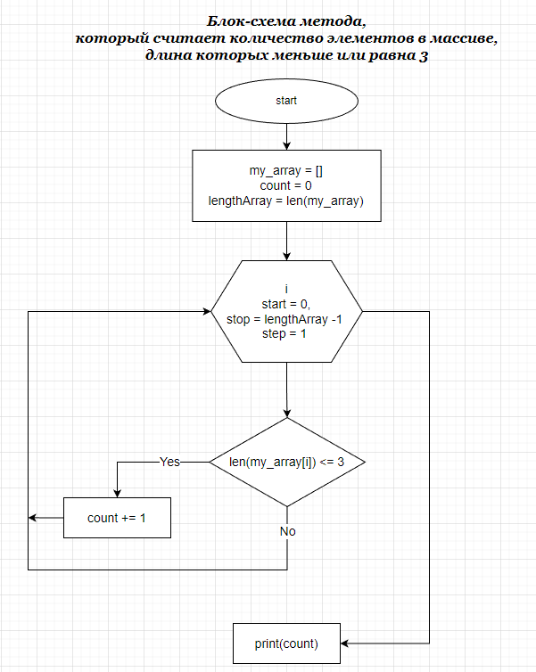

# Текстовое описание решения задачи

1. Декомпозиция. Нам необходимы следующие методы для нашего алгоритма:
    1. Метод GetNumberOfElemInArray возвращает количество элементов в массиве.
        * Составляем блок-схему метода GetNumberOfElemInArray
        
    2. Метод FilterElem для каждого элемента массива проверяет его длину, используя *Enumerable.Count Метод (System.Linq)*. Если длина элемента массива меньше или равна 3, наш метод возвращает true, в противном случае, возращает false.
    3. Метод CreateArray создает результирующий массив.
    4. Метод СopyRequiredElemToNewArray для каждого элемента массива, длина которого меньше или равна 3, копирует соответствующий элемент в результирующий массив.
    5. Метод PrintArray формирует строку для печати массива, используя *String.Join Метод (System)*.
2. На старте выполнения алгоритма задаем первоначальный массив строк.
3. Тестируем код нашего алгоритма.